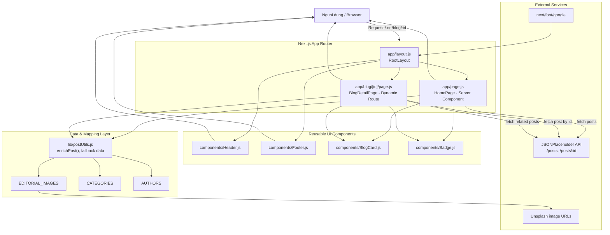
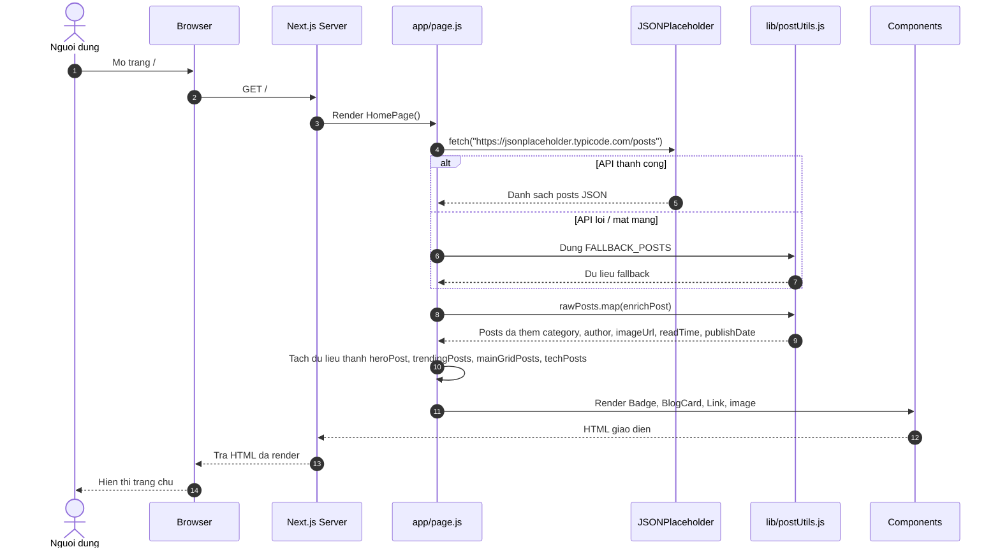
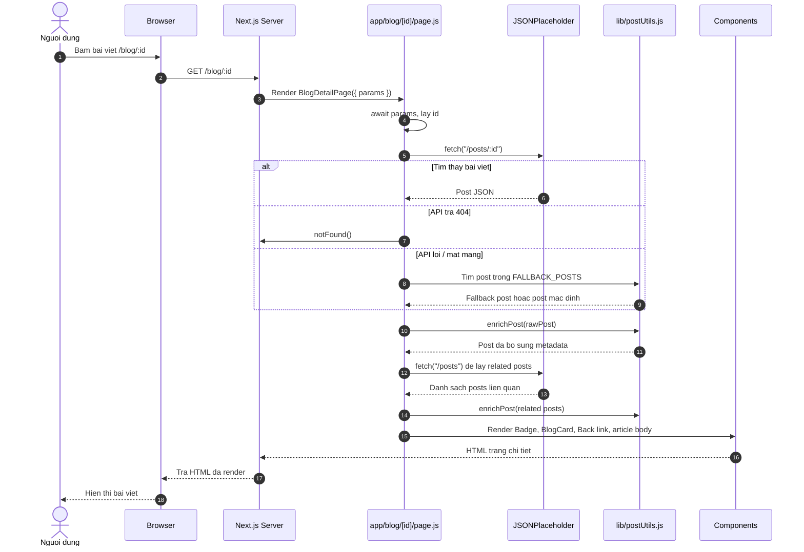
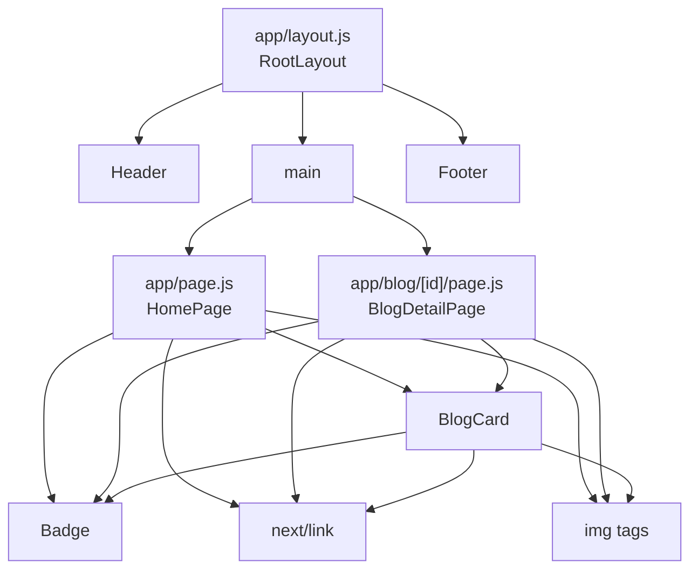
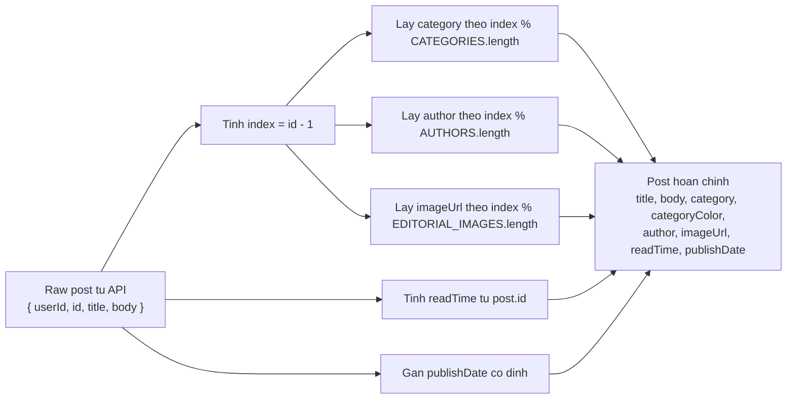

# So do luong code va kien truc du an

Tai lieu nay mo ta cach ung dung blog/editorial Next.js hoat dong dua tren code hien tai.

## 1. Tong quan kien truc

## 2. Luong hoat dong trang chu

## 3. Luong hoat dong trang chi tiet bai viet

## 4. Cay component hien tai

## 5. Luong xu ly du lieu trong `enrichPost`

## 6. Tom tat vai tro tung file

| File | Vai tro |
| --- | --- |
| `app/layout.js` | Layout goc, nap font, boc Header - main - Footer. |
| `app/page.js` | Trang chu, fetch danh sach posts, enrich du lieu, render hero/trending/grid/technology. |
| `app/blog/[id]/page.js` | Trang chi tiet bai viet, fetch post theo id, xu ly 404/fallback, render bai viet va related posts. |
| `lib/postUtils.js` | Chua du lieu anh/category/author fallback va ham `enrichPost`. |
| `components/Header.js` | Thanh masthead, menu danh muc, nut search. |
| `components/BlogCard.js` | Card bai viet tai su dung tren trang chu va related posts. |
| `components/Badge.js` | Badge category/author voi mau theo bien `color`. |
| `components/Footer.js` | Chan trang va cac lien ket thong tin. |
